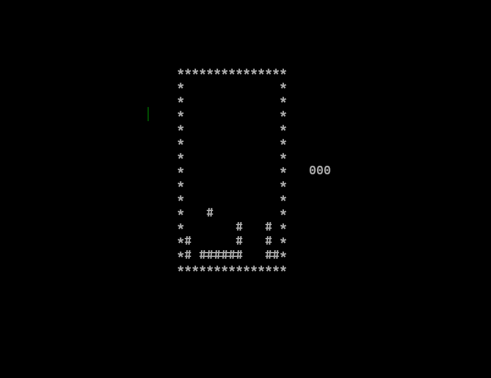

# Console Tetris

I tried to make a Tetris Like game in Teminal. 

This Game uses WinAPIs so it will not run on platform other than windows.

# Controls:

### Controls are simple:

**A or <-(Arrow)** :- Move piece to left   
**D or ->(Arrow)** :- Moves piece to right

# NOTE

> **Do not try to Resize the Console Window as it will break the Printing Process**
