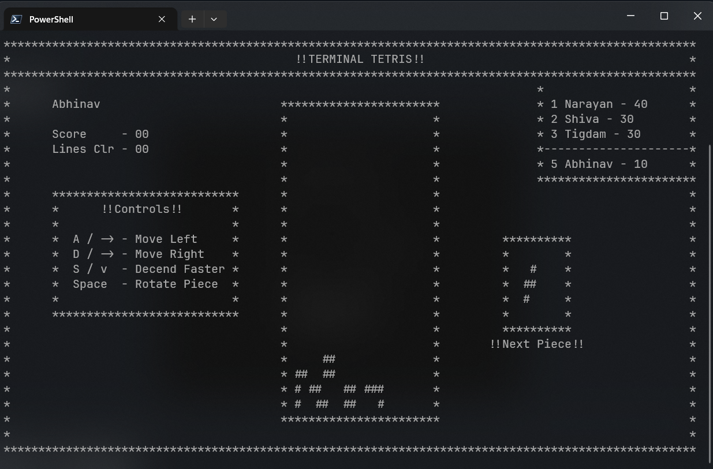

# Console Tetris

A modern **terminal-based Tetris** built in **C++**, featuring online player accounts, global leaderboards, and a cloud-hosted backend.

The project started as a classic console game and evolved into a full-stack application combining native C++, Spring Boot, PostgreSQL, and REST APIs.

<p align="center">
  
</p>

---

# Features

- Classic Tetris gameplay
- Player registration and login
- Global online leaderboards
- Spring Boot REST backend
- PostgreSQL database
- Cloud-hosted backend
- Distributed through GitHub Releases and WinGet
- Lightweight native Windows executable

---

# Installation

## Option 1 — WinGet (Recommended)

```powershell
winget install DarkFlame774.Tetris
```

## Option 2 — Manual Download

Download the latest executable from the **Releases** page.

---

# Controls

| Key | Action |
|------|--------|
| **A** or **←** | Move Left |
| **D** or **→** | Move Right |
| **S** or **↓** | Descend faster |
| **Space** | Rotate Piece |

---

# Notes

- This project currently supports **Windows only**.
- It uses the Windows API (Win32/WinHTTP) and is not cross-platform.
- Avoid resizing the console window while the game is running, as it may affect rendering.

---

# Tech Stack

### Client

- C++20
- Win32 API
- WinHTTP
- nlohmann/json

### Backend

- Spring Boot
- PostgreSQL
- REST APIs

### Deployment

- Render
- GitHub Releases
- WinGet

---

# 📸 Preview

<p align="center">
  
</p>

---

# What I Learned

This project gave me hands-on experience with:

- Modern C++ application development
- REST API design
- Backend development with Spring Boot
- PostgreSQL database design
- HTTP networking using WinHTTP
- Cloud deployment
- Windows application packaging and distribution

---

# License

This project is licensed under the MIT License.

---

⭐ If you found this project interesting, consider giving it a star!
